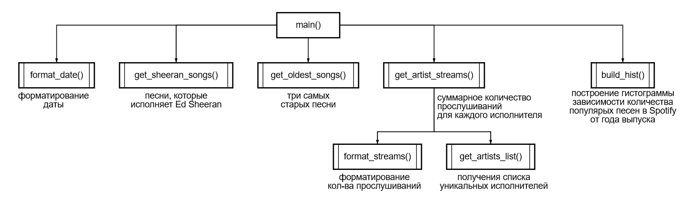

# Проект: анализ данных Spotify

Исполнитель: Никитин Антон

---

## Описание программы

Программа выполняет ряд функций по предварительному преобразованию данных и проводит анализ, извлекая из предоставленного датасета ("spotify_songs_top_100.csv") необходимую информацию (результаты анализа сохраняются в json-файл "spotify_analysis_results.json"):

* все песни, которые исполняет Ed Sheeran (в том числе с кем-то);
* три самых старых песни;
* суммарное количество прослушиваний для каждого исполнителя.

Также выполняется построение гистограммы зависимости количества популярых песен в Spotify от года выпуска (диаграмма сохраняется в png-файл "spotify_songs_by_year.png").

---

## Используемые модули

* pandas ([pandas.pydata.org](https://pandas.pydata.org/))
* matplotlib ([matplotlib.org](https://matplotlib.org/))
* datetime
* json
* typing

---

## Структура программы "spotify_analysis"

---

## Содержание репозитория

* __spotify_songs_top_100__ - датасет "Сто самых популярных песен на Spotify"
* __spotify_analysis.py__ - основная программа для анализа данных датасета "spotify_songs_top_100"
* __test_format_date.py__ - программа для тестирования функции "format_date" (из "spotify_analysis.py"), осуществляющей приведение даты в исходном датасете к единому формату
* __spotify_analysis_results.json__ - результаты анализа данных по Spotify
* __spotify_songs_by_year.png__ - гистограмма зависимости количества популярых песен в Spotify от года выпуска
* __program_structure.png__ - структура программы "spotify_analysis"
* __README.md__
